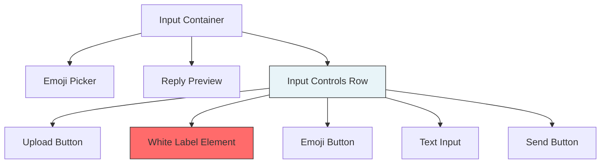
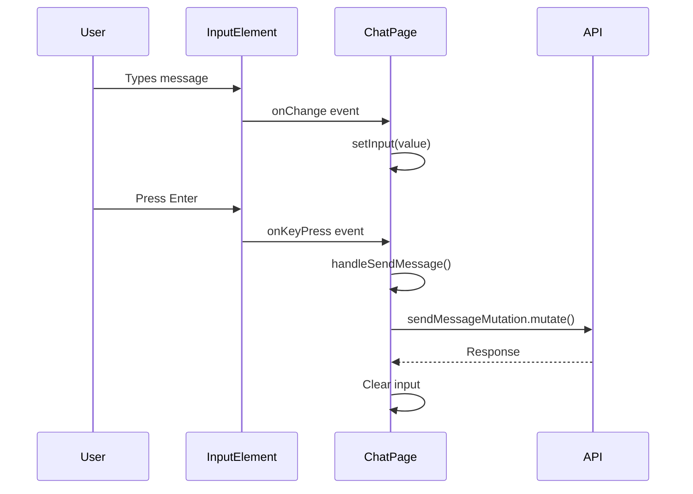

# Chat Input Styling - Remove White Bar

## Overview

This design addresses the removal of an unwanted white bar element in the message input section of the ChatPage component. The white bar is caused by an unused `<label>` element with white background styling that is currently visible in the input area.

## Technology Stack & Dependencies

- **Frontend Framework**: React 19.1.1 with TypeScript
- **Styling**: Tailwind CSS
- **Build Tool**: Vite 7.1.2
- **Component Location**: `src/pages/ChatPage.tsx`

## Component Architecture

### Current Message Input Structure

The message input section is located in the ChatPage component and consists of:



### Component Hierarchy

- **ChatPage Component**
  - Message Input Container (`div.p-4.border-t`)
    - Input Controls Row (`div.flex.items-center.bg-brand-dark`)
      - Upload Button
      - **Problematic White Label** ← Target for removal
      - Emoji Button
      - Text Input Field
      - Send Button

## Styling Strategy

### Current Implementation Analysis

The input section uses the following styling approach:

| Element | Current Classes | Purpose |
|---------|----------------|---------|
| Container | `p-4 border-t border-brand-muted/50 relative` | Main input section wrapper |
| Controls Row | `flex items-center space-x-3 bg-brand-dark rounded-full px-2` | Horizontal layout for controls |
| White Label | `flex items-center justify-center w-full h-full px-4 py-2 text-sm font-medium text-gray-700 bg-white border border-gray-300 rounded-md shadow-sm cursor-pointer hover:bg-gray-50 focus:outline-none focus:ring-2 focus:ring-offset-2 focus:ring-brand-gold` | **Unused element causing white bar** |

### Root Cause

The white bar is caused by an empty `<label>` element with the following problematic styling:
- `bg-white` - Creates white background
- `w-full h-full` - Takes up space
- `px-4 py-2` - Adds padding making it visible

## Data Flow Between Layers

### Input Interaction Flow



## Testing Strategy

### Unit Testing Approach

- **Component Rendering**: Verify input section renders without white background elements
- **Visual Regression**: Ensure removal doesn't affect layout
- **Functionality Testing**: Confirm input, upload, and emoji functionality remains intact
- **Accessibility Testing**: Validate aria-labels and keyboard navigation

### Test Cases

| Test Case | Expected Outcome |
|-----------|------------------|
| Input section renders | No white background elements visible |
| Text input functionality | User can type and send messages |
| Upload button functionality | File upload dialog opens correctly |
| Emoji button functionality | Emoji picker toggles correctly |
| Send button functionality | Messages are sent successfully |

### Testing Tools

- **Vitest** - Test runner
- **React Testing Library** - Component testing
- **jsdom** - DOM simulation

## Implementation Details

### File Changes Required

**Target File**: `src/pages/ChatPage.tsx`
**Lines**: Approximately 594-599

### Element Removal

The following unused label element should be removed:

```html
<!-- REMOVE THIS ELEMENT -->
<label
    htmlFor="image-upload"
    className="flex items-center justify-center w-full h-full px-4 py-2 text-sm font-medium text-gray-700 bg-white border border-gray-300 rounded-md shadow-sm cursor-pointer hover:bg-gray-50 focus:outline-none focus:ring-2 focus:ring-offset-2 focus:ring-brand-gold"
> 
</label>
```

### Layout Preservation

After removal, the input controls row will maintain proper spacing through existing Tailwind classes:
- `flex items-center space-x-3` - Maintains horizontal layout and spacing
- `bg-brand-dark rounded-full px-2` - Preserves dark theme styling

### Validation Steps

1. **Visual Verification**: Confirm no white elements in input area
2. **Functional Testing**: Verify all input controls work correctly
3. **Responsive Testing**: Check layout on mobile and desktop
4. **Theme Consistency**: Ensure dark theme is maintained throughout

## Visual Representation

### Before (Current State)

```
[📤] [WHITE BAR] [😊] [Type message...] [📤]
```

### After (Expected State)

```
[📤] [😊] [Type message...] [📤]
```

The white bar element will be completely removed, creating a cleaner, more consistent dark-themed input interface.