# Prayer Admin Dashboard Updates Design

## Overview

This design document outlines three critical enhancements to the Torch Fellowship application: fixing prayer request privacy controls, implementing statistics card routing in the admin dashboard, and adding image media support to light communities. These improvements will enhance user experience, streamline administrative workflows, and improve community engagement features.

## Technology Stack

- **Frontend**: React 19.1.1, TypeScript, React Router 7.8.1, Tailwind CSS
- **Backend**: Node.js, Express.js, MongoDB
- **State Management**: Zustand 5.0.7, React Query 5.85.3
- **Media Storage**: Cloudinary integration
- **Authentication**: JWT-based with role-based access control

## Architecture

### Component Architecture

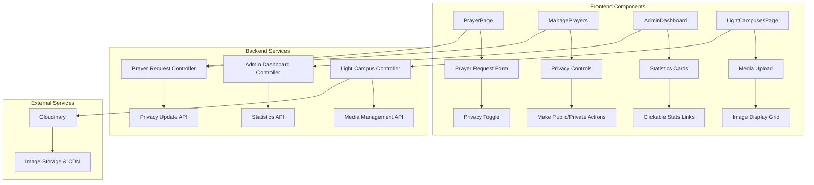

## Feature 1: Prayer Request Privacy Controls Fix

### Current Issues

Based on code analysis, the current implementation has the following issues:
- Privacy toggle functionality exists but may have inconsistent behavior
- UI feedback for privacy state changes needs improvement
- Potential race conditions in state updates

### Data Model Enhancement

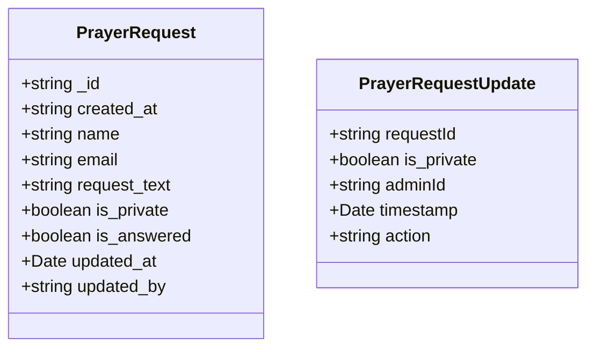

### Frontend Implementation

#### Privacy Control Components

**Enhanced ManagePrayers Component:**
- Improved visual feedback for privacy state
- Confirmation dialogs for privacy changes
- Batch privacy operations
- Audit trail display

**PrayerPage Privacy Toggle:**
- Clear labeling of privacy implications
- Preview of how request appears when public/private
- Enhanced checkbox styling and interaction

#### UI/UX Improvements

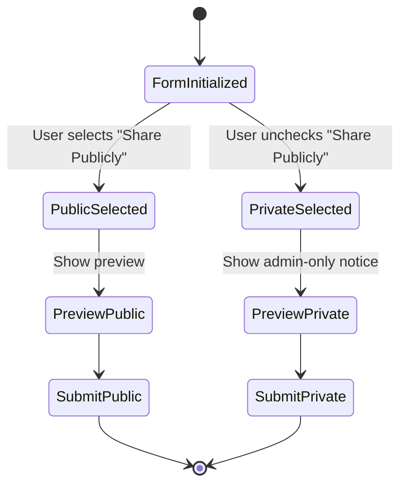

### Backend API Enhancements

#### Enhanced Privacy Management Endpoints

**PUT /api/prayer-requests/admin/:id/privacy**
- Dedicated endpoint for privacy changes
- Audit logging
- Validation of privacy state transitions

**GET /api/prayer-requests/admin/audit/:id**
- Retrieve privacy change history
- Admin action tracking

### Privacy Control Workflow

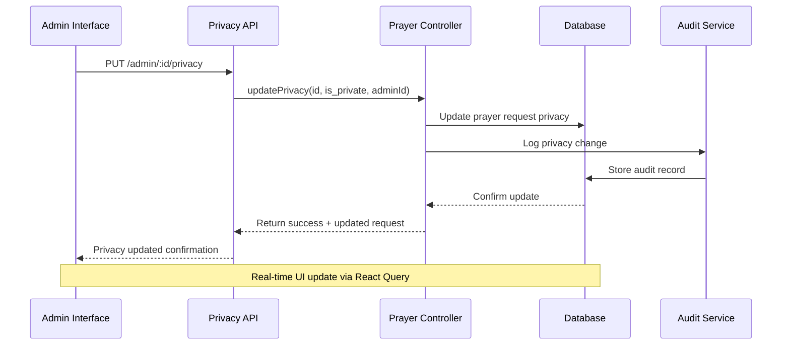

## Feature 2: Admin Dashboard Statistics Card Routing

### Current Issue Analysis

The AdminDashboard component displays statistics cards but lacks navigation links to corresponding management pages. Cards show metrics but don't provide actionable pathways for administrators.

### Enhanced Statistics Cards Architecture

#### Clickable Statistics Cards

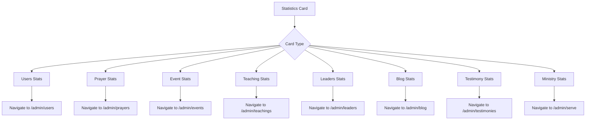

### Component Architecture Enhancement

#### Enhanced AdminDashboard Structure

**Primary Statistics Cards (Clickable):**
- User Growth → `/admin/users`
- Prayer Requests → `/admin/prayers`
- Upcoming Events → `/admin/events`

**Secondary Statistics Cards (Clickable):**
- Leaders → `/admin/leaders`
- Blog Posts → `/admin/blog`
- Teachings → `/admin/teachings`
- Testimonies → `/admin/testimonies`

#### Rich Data Visualization Cards

**MinistryTeamsOverview Component:**
- Display ministry team statistics with donut chart
- Click-through to ministry management
- Team member count and activity metrics

**PrayerRequestsOverview Component:**
- Prayer request trends with line chart
- Answered vs pending visualization
- Direct link to prayer management

### Interactive Statistics Implementation

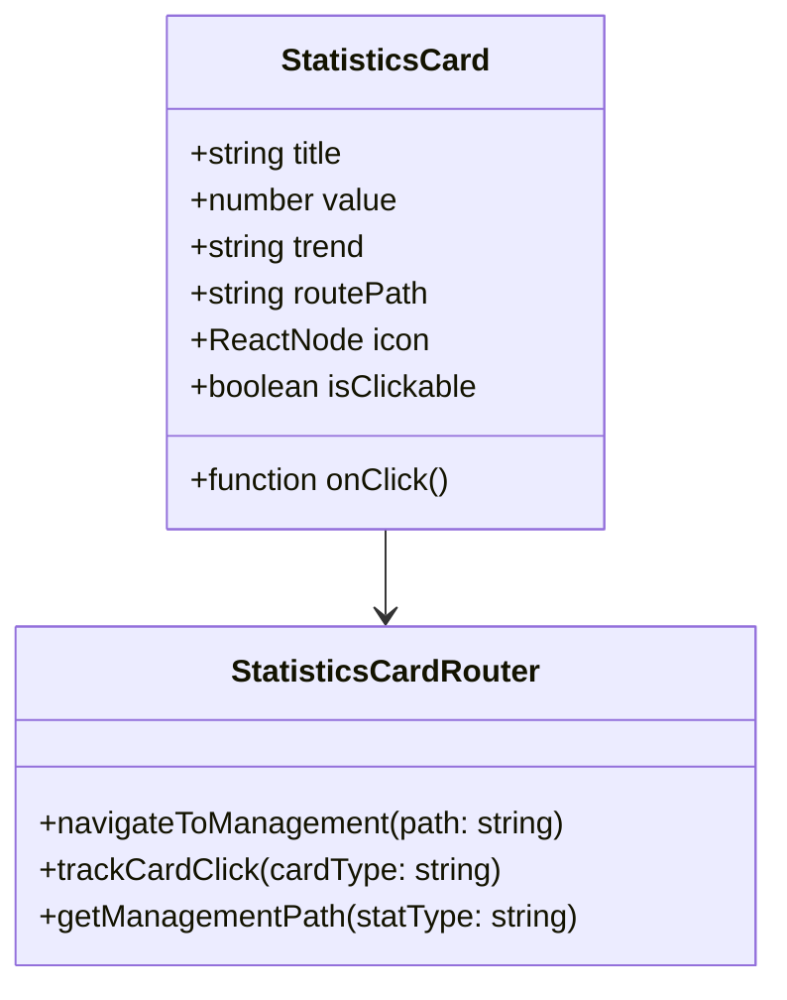

### Navigation Enhancement Workflow

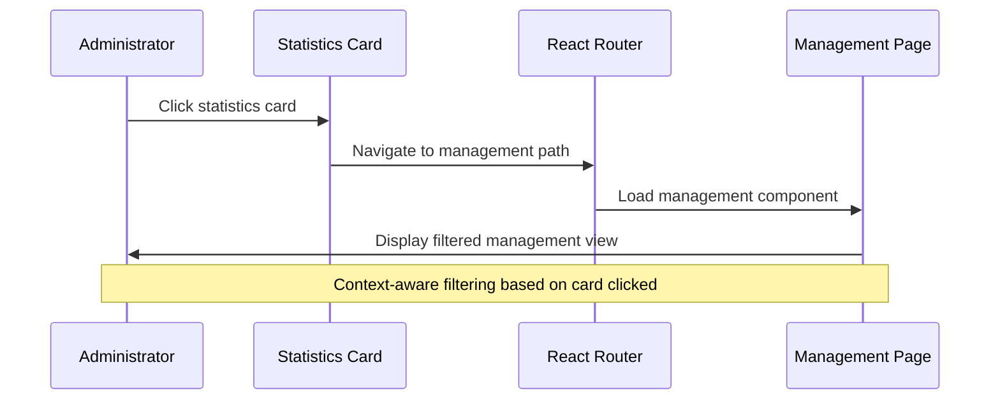

## Feature 3: Light Communities Media Enhancement

### Current State Analysis

The LightCampusesPage currently displays text-based information without visual elements. Adding image support will improve community engagement and visual appeal.

### Enhanced Data Model

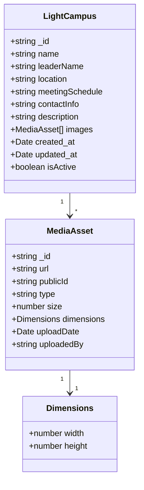

### Media Upload Architecture

#### Frontend Components

**Enhanced LightCampusesPage:**
- Image grid display for each campus
- Responsive image gallery
- Lazy loading for performance
- Image modal/lightbox for detailed view

**Admin Campus Management:**
- Drag-and-drop image upload
- Multiple image support
- Image cropping and resizing tools
- Bulk image operations

#### Cloudinary Integration

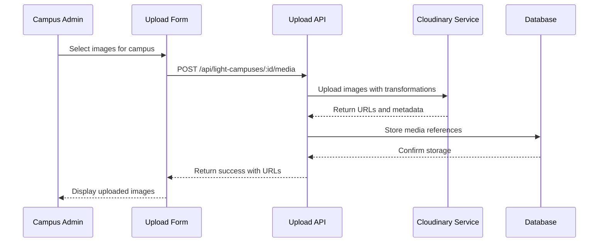

### Media Management Features

#### Image Processing Pipeline

**Automatic Transformations:**
- Thumbnail generation (300x200)
- Medium size (600x400) 
- Large display (1200x800)
- WebP format conversion for performance

**Upload Validation:**
- File type restrictions (JPEG, PNG, WebP)
- Size limits (max 5MB per image)
- Dimension requirements (min 800x600)
- Content moderation via Cloudinary AI

#### Enhanced UI Components

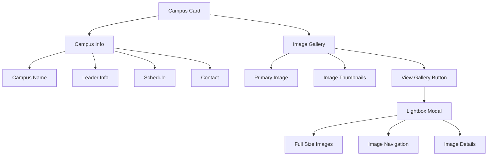

### Community Page Enhancement Workflow

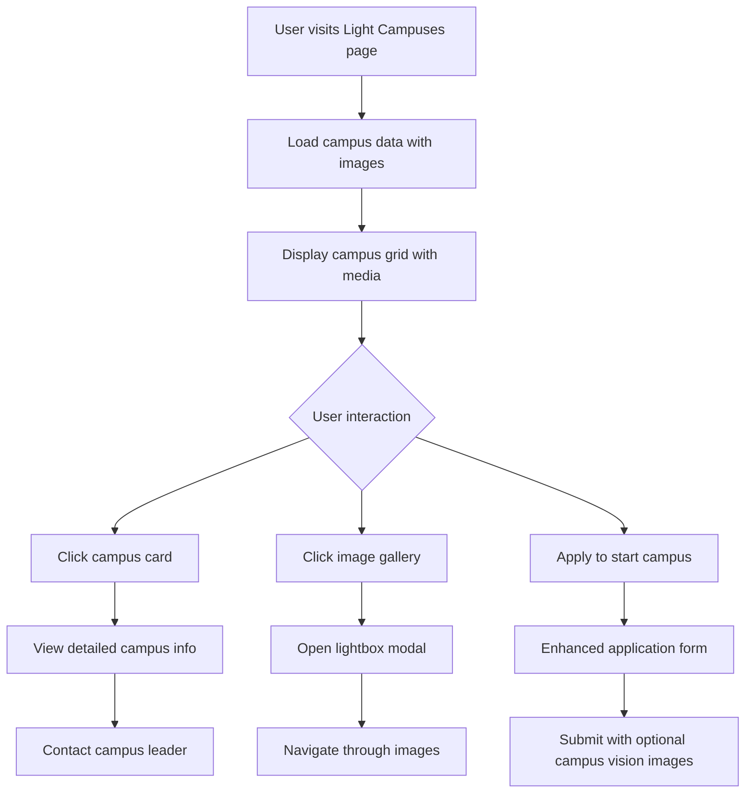

## Implementation Strategy

### Phase 1: Prayer Privacy Controls (Week 1)

**Frontend Tasks:**
1. Enhance privacy toggle UI in PrayerPage
2. Improve admin privacy controls in ManagePrayers
3. Add confirmation dialogs for privacy changes
4. Implement visual feedback for state changes

**Backend Tasks:**
1. Create dedicated privacy management endpoints
2. Add audit logging for privacy changes
3. Enhance validation and error handling
4. Update API documentation

### Phase 2: Dashboard Statistics Routing (Week 2)

**Frontend Tasks:**
1. Convert statistics cards to clickable components
2. Implement navigation logic with React Router
3. Add hover states and click feedback
4. Create context-aware filtering in management pages

**Backend Tasks:**
1. Ensure all management endpoints support filtering
2. Add analytics tracking for card interactions
3. Optimize statistics queries for performance

### Phase 3: Light Communities Media (Week 3)

**Frontend Tasks:**
1. Design and implement image gallery components
2. Add media upload interface for admin
3. Implement responsive image display
4. Create lightbox modal for image viewing

**Backend Tasks:**
1. Extend LightCampus model with media fields
2. Implement Cloudinary upload endpoints
3. Add image processing and validation
4. Create media management APIs

## Testing Strategy

### Unit Testing

**Prayer Privacy Controls:**
- Privacy toggle state management
- API request/response handling
- Permission validation
- Audit trail functionality

**Dashboard Navigation:**
- Route navigation accuracy
- Card click event handling
- Context preservation across navigation
- Loading state management

**Media Management:**
- File upload validation
- Image processing workflows
- Gallery component interactions
- Responsive image loading

### Integration Testing

**End-to-End Workflows:**
1. Complete prayer request privacy change workflow
2. Admin dashboard navigation to management pages
3. Campus media upload and display workflow

### Performance Testing

**Media Optimization:**
- Image loading performance
- Cloudinary transformation efficiency
- Gallery scroll performance
- Mobile responsiveness

## Security Considerations

### Privacy Controls
- Role-based access validation
- Audit trail integrity
- Data encryption for sensitive requests

### Media Upload Security
- File type validation
- Size limit enforcement
- Content moderation
- Secure URL generation

### Admin Dashboard Security
- Route protection validation
- Statistics data access control
- Session management

## Monitoring and Analytics

### Key Metrics

**Prayer Management:**
- Privacy change frequency
- Admin response times
- User satisfaction with privacy controls

**Dashboard Usage:**
- Statistics card click-through rates
- Navigation pattern analysis
- Admin workflow efficiency

**Media Engagement:**
- Image view rates
- Gallery interaction metrics
- Upload success rates

## Future Enhancements

### Prayer Features
- Bulk privacy operations
- Prayer request categories
- Automated privacy settings

### Dashboard Features
- Customizable dashboard layouts
- Advanced filtering options
- Export capabilities

### Media Features
- Video support for campuses
- 360-degree campus tours
- User-generated content galleries