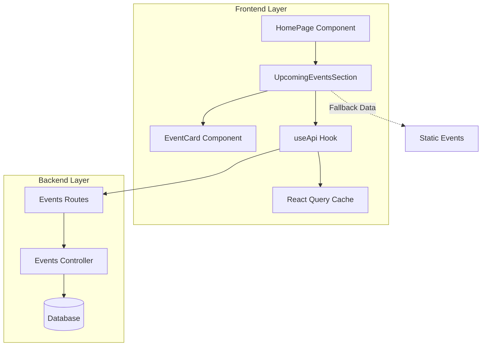
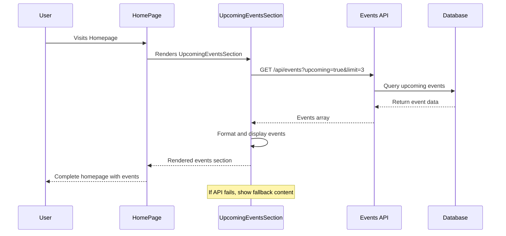

# Upcoming Events Homepage Display

## Overview

This design document outlines the implementation for displaying upcoming events dynamically on the Torch Fellowship homepage. Currently, the homepage shows only a static Tuesday Fellowship event in the "Featured Content" section. This enhancement will replace that with a more comprehensive upcoming events display that fetches real-time data from the events API and presents multiple upcoming events in an engaging, user-friendly format.

## Architecture

### System Context

The Torch Fellowship application is a full-stack web application built with React 19 + TypeScript frontend and Node.js/Express backend. The current system already has:

- **Events API**: `/api/events` with filtering capabilities (`?upcoming=true&limit=N`)
- **Event Management**: Admin panel for creating/editing events
- **Homepage Structure**: Existing "Featured Content" section with 3-column layout
- **Event Display Components**: `UpcomingEventCard` (currently shows static data)

### Architecture Diagram



### Data Flow



## Component Architecture

### HomePage Component Enhancement

The existing `HomePage` component will be modified to include dynamic events fetching alongside the current teaching and blog queries.

**Current State:**
```typescript
// Shows only static tuesdayFellowship event
<UpcomingEventCard event={tuesdayFellowship} />
```

**Enhanced State:**
```typescript
// Dynamic events section with multiple events
<UpcomingEventsSection />
```

### New UpcomingEventsSection Component

A new component will replace the single static event display with a dynamic, multi-event section:

**Component Structure:**
- **Purpose**: Fetch and display 2-3 most upcoming events
- **Fallback Strategy**: Show static events when API unavailable
- **Responsive Design**: Adapt layout for different screen sizes
- **Error Handling**: Graceful degradation with user-friendly messaging

**Key Features:**
- React Query integration for caching and error handling
- Responsive grid layout (1-3 columns based on screen size)
- Loading states with skeleton placeholders
- Empty state handling
- "View All Events" navigation link

### Event Display Patterns

**Desktop Layout (3 events):**
```
┌─────────────┐ ┌─────────────┐ ┌─────────────┐
│   Event 1   │ │   Event 2   │ │   Event 3   │
│ (Featured)  │ │             │ │             │
└─────────────┘ └─────────────┘ └─────────────┘
```

**Tablet Layout (2 events):**
```
┌─────────────────┐ ┌─────────────────┐
│     Event 1     │ │     Event 2     │
│   (Featured)    │ │                 │
└─────────────────┘ └─────────────────┘
```

**Mobile Layout (1 event):**
```
┌───────────────────────────────┐
│           Event 1             │
│         (Featured)            │
└───────────────────────────────┘
```

## API Integration Strategy

### Endpoint Usage

**Primary Endpoint**: `GET /api/events?upcoming=true&limit=3`

**Query Parameters:**
- `upcoming=true`: Filter events with date >= today  
- `limit=3`: Maximum 3 events for homepage display
- Default sorting: `event_date` ascending (earliest first)

**Response Schema:**
```json
[
  {
    "_id": "string",
    "title": "string",
    "location": "string", 
    "event_date": "YYYY-MM-DD",
    "event_time": "HH:MM",
    "description": "string",
    "image_base64": "string|null",
    "max_attendees": "number|null",
    "registration_required": "boolean"
  }
]
```

### Error Handling Strategy

```mermaid
flowchart TD
    A[API Request] --> B{Request Success?}
    B -->|Yes| C{Events Available?}
    B -->|No| D[Show Fallback Events]
    C -->|Yes| E[Display Real Events]
    C -->|No| F[Show Empty State]
    
    D --> G[Log Error & Show Demo Mode]
    E --> H[Cache for 5 minutes]
    F --> I[Show "No Events" Message]
```

**Fallback Events:**
When API is unavailable, display static fallback events including the Tuesday Fellowship and sample events to maintain user experience.

### Caching Strategy

- **Cache Key**: `['homepage-events']`
- **Stale Time**: 5 minutes (300,000ms)
- **Retry Policy**: 1 retry on failure, then fallback
- **Background Refetch**: On window focus and reconnect

## User Interface Design

### Visual Design Principles

**Consistency with Existing Design:**
- Maintain current brand colors (`brand-gold`, `brand-surface`, `brand-dark`)
- Use existing typography scale (`font-serif` for headings)
- Follow established spacing patterns (`p-6`, `gap-8`)
- Consistent with `LatestTeachingCard` and `FeaturedBlogCard` styling

**Enhanced Visual Hierarchy:**
- **Section Title**: "Upcoming Events" with subtitle
- **Featured Event**: Larger card with enhanced styling for next event
- **Secondary Events**: Standard card size with essential information
- **Call-to-Action**: Prominent "View All Events" link

### Event Card Design

**Card Structure:**
```
┌─────────────────────────────────┐
│          Event Image            │
│      (if available)             │
├─────────────────────────────────┤
│ EVENT TYPE BADGE               │
│ Event Title                     │
│ Brief Description (truncated)   │
│                                │
│ 📅 Date: Monday, Jan 15, 2024   │
│ 🕐 Time: 6:00 PM               │
│ 📍 Location: Main Hall          │
│                                │
│ [Register/Learn More] →         │
└─────────────────────────────────┘
```

**Interactive Elements:**
- Hover effects with subtle scale and glow
- Click to navigate to full Events page
- Registration button for required events
- Smooth animations using existing `AnimatedSection`

### Responsive Behavior

**Breakpoint Strategy:**
- **Mobile (< 768px)**: Single column, stack vertically
- **Tablet (768px - 1024px)**: Two columns side-by-side  
- **Desktop (> 1024px)**: Three columns horizontal

**Content Adaptation:**
- **Mobile**: Show essential info only, shorter descriptions
- **Tablet**: Balanced content with moderate detail
- **Desktop**: Full content with complete descriptions

## Data Models & State Management

### Event Interface

The existing `Event` interface from `types.ts` will be used:

```typescript
interface Event {
  _id?: string;
  created_at: string;
  title: string;
  location: string;
  event_date: string;
  event_time: string;
  max_attendees?: number;
  registration_required: boolean;
  description: string;
  image_base64?: string | null;
}
```

### Date Handling Logic

**Date Formatting Utilities:**
- **Relative Dates**: "Today", "Tomorrow", "In 3 days"
- **Formatted Dates**: "Monday, January 15, 2024"
- **Recurring Events**: Handle `event_date: 'recurring-tuesday'`

**Time Display:**
- Convert 24-hour to 12-hour format if needed
- Handle time ranges: "5:00 PM - 8:00 PM"
- Show duration when available

### State Structure

```typescript
interface UpcomingEventsState {
  events: Event[];
  isLoading: boolean;
  error: Error | null;
  fallbackMode: boolean;
}
```

## Business Logic Layer

### Event Selection Logic

**Priority Algorithm:**
1. **Upcoming Events Only**: `event_date >= today`
2. **Date Sorting**: Earliest events first
3. **Limit Application**: Maximum 3 events for homepage
4. **Registration Priority**: Prioritize events requiring registration

**Special Handling:**
- **Recurring Events**: Always include Tuesday Fellowship if no other events
- **Past Events**: Automatically filter out expired events
- **Same Day Events**: Sort by time if multiple events on same date

### Content Display Rules

**Description Truncation:**
- **Mobile**: 80 characters maximum
- **Tablet**: 120 characters maximum  
- **Desktop**: 150 characters maximum
- Add "..." for truncated content

**Image Handling:**
- **Fallback Images**: Use default event imagery when `image_base64` is null
- **Image Optimization**: Lazy loading and responsive sizing
- **Alt Text**: Generated from event title and description

### Navigation Logic

**Click Behavior:**
- **Event Cards**: Navigate to `/events` page with scroll to specific event
- **"View All Events"**: Navigate to `/events` page
- **Registration Required**: Show registration prompt/modal

## Testing Strategy

### Unit Testing Approach

**Component Testing:**
- **UpcomingEventsSection**: Render with mock data
- **Event Card**: Display formatting and interactions
- **Error States**: Fallback behavior and error handling
- **Loading States**: Skeleton/spinner display

**API Integration Testing:**
- **Success Response**: Proper event display
- **Empty Response**: Empty state handling  
- **Error Response**: Fallback activation
- **Network Failure**: Offline behavior

**Mock Data Strategy:**
```typescript
const mockEvents: Event[] = [
  {
    _id: 'test-1',
    title: 'Sunday Worship Service',
    event_date: '2024-01-14',
    event_time: '10:00',
    location: 'Main Sanctuary',
    description: 'Join us for worship and fellowship',
    registration_required: false,
    created_at: new Date().toISOString()
  }
];
```

### Integration Testing

**User Flow Testing:**
1. **Homepage Load**: Events section displays correctly
2. **API Integration**: Real data populates properly  
3. **Navigation**: Links redirect to events page correctly
4. **Responsive Design**: Layout adapts to different screen sizes
5. **Error Recovery**: Graceful handling of API failures

**Performance Testing:**
- **Load Time**: Measure initial render performance
- **Cache Effectiveness**: Verify React Query caching works
- **Image Loading**: Test lazy loading and fallback images
- **Memory Usage**: Monitor for potential memory leaks

### Accessibility Testing

**Screen Reader Support:**
- **Semantic HTML**: Proper heading hierarchy and landmarks
- **Alt Text**: Meaningful image descriptions
- **Focus Management**: Keyboard navigation support
- **ARIA Labels**: Clear button and link descriptions

**Visual Accessibility:**
- **Color Contrast**: Maintain WCAG AA compliance
- **Text Size**: Readable at different zoom levels
- **Touch Targets**: Minimum 44px tap targets on mobile
- **Motion**: Respect reduced motion preferences

## Implementation Phases

### Phase 1: Core Infrastructure
**Duration**: 2-3 days

**Tasks:**
- Create `UpcomingEventsSection` component
- Implement API integration with React Query
- Add error handling and fallback mechanisms
- Create basic event card layout

**Deliverables:**
- Functional events fetching
- Basic UI rendering
- Error handling implementation

### Phase 2: Enhanced UI/UX
**Duration**: 2-3 days

**Tasks:**
- Implement responsive design breakpoints
- Add loading states and animations
- Create enhanced event card styling
- Add navigation and interaction logic

**Deliverables:**
- Mobile-responsive design
- Smooth animations and transitions
- Complete event card design

### Phase 3: Integration & Testing
**Duration**: 1-2 days

**Tasks:**
- Integrate into existing HomePage
- Implement comprehensive testing
- Performance optimization
- Accessibility compliance

**Deliverables:**
- Fully integrated feature
- Complete test coverage
- Performance benchmarks
- Accessibility audit

## Performance Considerations

### Optimization Strategies

**API Optimization:**
- **Query Limitations**: Limit to 3 events maximum
- **Field Selection**: Only fetch required fields
- **Efficient Filtering**: Server-side date filtering
- **Response Caching**: 5-minute cache duration

**Rendering Optimization:**
- **Lazy Loading**: Images loaded on demand
- **Memoization**: React.memo for event cards
- **Virtual Scrolling**: Not needed for 3 items
- **Bundle Splitting**: Code splitting if component grows

**Network Optimization:**
- **Request Batching**: Combine with other homepage requests if possible
- **Compression**: Ensure API responses are compressed
- **CDN Usage**: Utilize CDN for event images
- **Prefetching**: Preload events page on hover

### Performance Metrics

**Target Metrics:**
- **Initial Load**: < 200ms for events section
- **API Response**: < 500ms for events endpoint
- **Image Loading**: < 1s for event images
- **Interactive Ready**: < 300ms for click responsiveness

**Monitoring:**
- **Core Web Vitals**: LCP, FID, CLS compliance
- **API Performance**: Response time tracking
- **Error Rates**: API failure monitoring
- **User Engagement**: Click-through rates to events page

## Security Considerations

### Data Security

**API Security:**
- **Authentication**: Public endpoints, no sensitive data
- **Rate Limiting**: Prevent abuse of events endpoint
- **Input Validation**: Validate query parameters
- **CORS Configuration**: Proper frontend domain restrictions

**Content Security:**
- **Image Validation**: Verify image URLs and base64 data
- **XSS Prevention**: Sanitize event descriptions
- **CSRF Protection**: Standard token validation
- **Content Filtering**: Prevent malicious content injection

### Privacy Considerations

**Data Minimization:**
- **Public Information**: Only display publicly available events
- **Personal Data**: No user-specific information exposed
- **Analytics**: Aggregate usage data only
- **Cache Privacy**: No personal data in client cache

## Monitoring & Analytics

### Performance Monitoring

**Key Metrics:**
- **API Response Times**: Track `/api/events` performance
- **Error Rates**: Monitor API failure rates
- **Cache Hit Rates**: React Query cache effectiveness
- **User Engagement**: Events section interaction rates

**Alerting Thresholds:**
- **API Errors**: > 5% error rate triggers alert
- **Response Time**: > 1s response time triggers alert
- **Cache Miss**: > 20% cache miss rate triggers review
- **User Complaints**: Direct feedback monitoring

### Analytics Integration

**Event Tracking:**
- **Section Views**: Homepage events section visibility
- **Click-Through**: Events page navigation from homepage
- **Event Interactions**: Individual event card clicks
- **Registration Conversions**: Registration button clicks

**User Behavior:**
- **Scroll Depth**: How far users scroll to events section
- **Time on Section**: Engagement duration with events
- **Device Patterns**: Mobile vs desktop usage patterns
- **Repeat Visits**: Return visitor engagement with events

## Future Enhancements

### Potential Improvements

**Enhanced Functionality:**
- **Event Categories**: Filter by event type (worship, fellowship, etc.)
- **Personal Calendar**: Integration with user calendar systems
- **Event Reminders**: Push notifications for upcoming events
- **Social Sharing**: Share events on social media platforms

**Advanced Features:**
- **Event Registration**: Direct registration from homepage cards
- **Waitlist Management**: Handle overcapacity events
- **Event Feedback**: Post-event rating and feedback collection
- **Attendance Tracking**: QR code check-in integration

**Technical Improvements:**
- **Real-time Updates**: WebSocket integration for live updates
- **Offline Support**: Service worker for offline event viewing
- **Progressive Enhancement**: Advanced features for capable browsers
- **Internationalization**: Multi-language event content

### Scalability Considerations

**Data Growth:**
- **Event Archival**: Strategy for handling large event history
- **Search Optimization**: Elasticsearch for event search
- **Media Storage**: CDN strategy for event images
- **Database Scaling**: Indexing and query optimization

**User Growth:**
- **Load Balancing**: Handle increased API traffic
- **Edge Caching**: Geographic content distribution
- **Mobile Optimization**: Enhanced mobile performance
- **Accessibility**: Advanced accessibility features